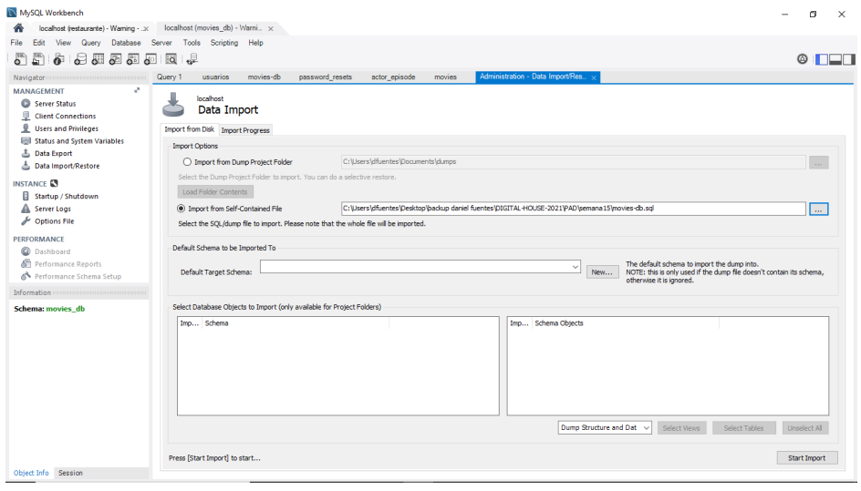

# Uniones y funciones de agregación

## Objetivo
Retomando la base de datos de películas vamos a practicar cómo realizar consultas
consumiendo datos de diferentes tablas.

Si aún no tenemos la base de datos, podemos descargar el script haciendo click acá.
Recordemos que va a ser necesario importarlo y ejecutarlo en Workbench o algún
programa similar.

A continuación, planteamos diferentes consultas que debemos realizar sobre esta base de
datos.

Algunas sugerencias de cómo encarar el ejercicio:
- Empezar por generar una mirada rápida a las tablas y sus campos para tener una
idea de dónde buscar la información.
- Recordar que, como en todo el resto de los ambientes, tenemos una consola y que,
si MySQL da un error, va a detallar muy bien qué salió mal. 🤓☝
Sin más preámbulo, arranquemos con los micro desafíos.
¡Buena suerte!😎👍✨

## Ubicación -> Programación/TRABAJOS PRACTICOS/Uniones y funciones de agregación 